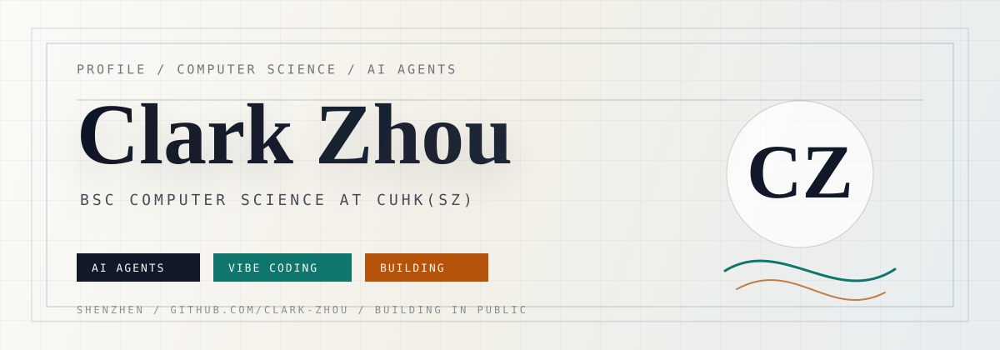

<p align="center">
  
</p>

<br>

<table>
  <tr>
    <td width="64%">

### About

Hi, I'm **Clark** - a Computer Science student at **CUHK(SZ)**.

I am learning by building: small tools, AI-agent experiments, and product-like interfaces that turn vague ideas into something testable.

I like work that sits between **software engineering**, **AI workflows**, and **human-friendly product design**.

    </td>
    <td width="36%">

### Snapshot

```txt
role      BSc CS student
school    CUHK(SZ)
focus     AI agents
mode      vibe-coding learner
location  Shenzhen / China
```

    </td>
  </tr>
</table>

---

### Now

- Building and learning through an **AI-Agent project**
- Practicing full-stack product thinking from idea to usable prototype
- Exploring how AI tools change the way developers design, code, and ship

### Stack I Am Growing

<p>
  
</p>

### Selected Work

| Project | What it shows | Status |
| --- | --- | --- |
| AI-Agent Project | Agent workflows, product thinking, iterative building | In progress |
| Personal GitHub Home | Identity, presentation, and developer storytelling | Building |

### GitHub Signal

<p align="center">
  
  
</p>

---

<p align="center">
  <sub>
    <code>Clark-Zhou</code> / <code>124090947@link.cuhk.edu.cn</code>
  </sub>
</p>
