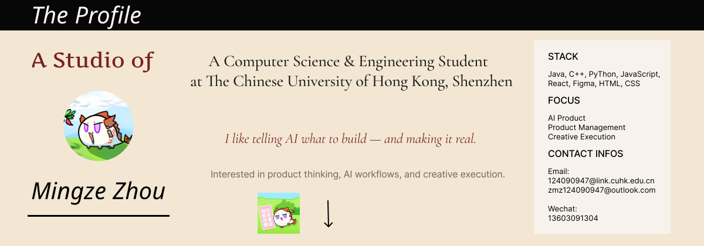

  

 

## Hi, I'm Clark Zhou

I am an undergraduate student at CUHK-Shenzhen, majoring in Computer Science and Engineering.

Although my academic background is in computer science, I am especially interested in building products. My long-term goal is to become a product manager for AI and Internet products.

I am currently working on several personal projects:

- An AI interview simulator
- A public personal website for self-introduction
- A website for story ideas and creative notes

## What I Care About

I believe applications should be useful, efficient, and genuinely connected to real needs. I want to build products that can solve practical problems for myself and the people around me.

## Tech Stack

At university, I have studied Java, C++, and Python. To broaden my development skills, I am also learning JavaScript and React by myself.

## My Personal Style

I am comfortable working with multiple AI coding sessions to build, develop, test, and review software. At the same time, I actively read and write key parts of the code myself, so that I can understand both the product direction and the technical details.

## Connect

My GitHub: [Clark-Zhou](https://github.com/Clark-Zhou)
